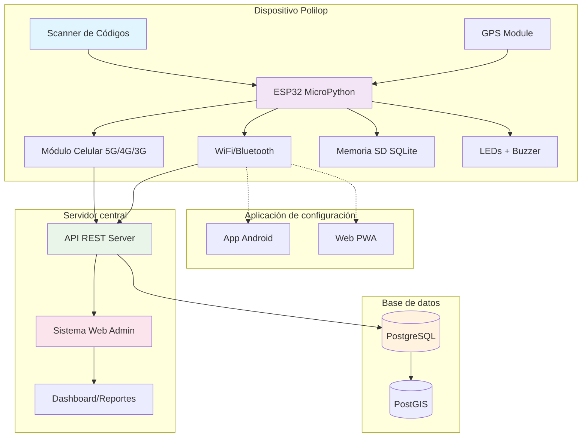
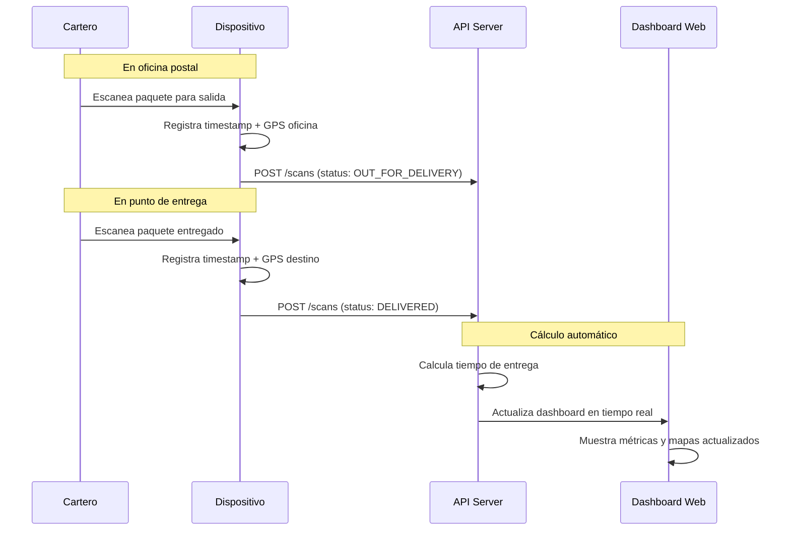
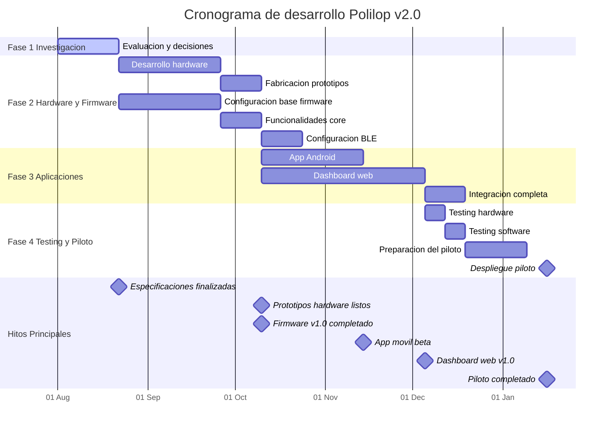

# Polilop - Sistema integral de seguimiento postal v2.0

## Descripción del proyecto

Polilop es un **sistema integral** de hardware libre y software GNU diseñado para la administración pública, específicamente para Correos de México. El sistema permite el seguimiento completo de paquetes y correspondencia desde la oficina postal hasta su entrega final, con capacidades avanzadas de georeferenciación y análisis de tiempos de entrega.

## Componentes del sistema

El proyecto Polilop v2.0 consta de **tres desarrollos principales** que trabajan en conjunto:

### 🔧 1. Dispositivo escáner autónomo
Dispositivo portátil con ESP32, conectividad 5G/4G/3G, GPS y scanner de códigos de barras. Operación completamente autónoma con sincronización automática.

### 📱 2. Aplicación móvil Android
Aplicación para configuración y administración de dispositivos via Bluetooth. Incluye gestión de conectividad WiFi/celular y actualizaciones de firmware.

### 🌐 3. Dashboard web administrativo
Plataforma web para visualización de datos, reportes de entregas, mapas de calor georreferenciados y análisis de tiempos de entrega en tiempo real.

## Características técnicas

### Hardware principal
- **Diseño**: Forma cilíndrica o cilindroide para operación cómoda con una mano
- **Microcontrolador**: ESP32 con soporte para MicroPython
- **Conectividad local**: 
  - WiFi 802.11 b/g/n
  - Bluetooth 4.2/BLE (para configuración administrativa)
- **Conectividad celular**: 
  - Módulo 5G/4G/3G con fallback automático según disponibilidad
  - SIM card integrada para conectividad autónoma
- **Localización**: GPS integrado para georeferenciación
- **Almacenamiento**: 
  - Memoria SD integrada para almacenamiento temporal
  - Formato a definir: SQLite vs JSON
- **Scanner**: Módulo de escaneo de códigos de barras 1D/2D
- **Interfaz**: 
  - Botón pequeño de encendido
  - Botón grande para escaneo
  - LEDs indicadores:
    - LED verde: Encendido del dispositivo y estado de batería
      - Sólido: Encendido, batería >10%
      - Parpadeando rápido: Batería <10%
      - Parpadeando lento: Cargando
      - Sólido brillante: Carga completa
    - LED RGB: Estados de escaneo y conectividad
      - Verde: Éxito de escaneo
      - Rojo: Fallo de escaneo
      - Azul: Estado Bluetooth
      - Amarillo: Estado WiFi
      - Naranja: Estado celular
  - Botón oculto/combinación para modo de configuración Bluetooth
- **Feedback de escaneo**:
  - Beep audible para escaneo exitoso
  - Sonido de tono grave para fallo
- **Alimentación**: 
  - **Configuración estándar**: Batería Li-Po 3.7V 2500mAh (8-10h autonomía, 168g total)
  - **Configuración extendida**: Batería Li-Po 3.7V 4000mAh (13-15h autonomía, 193g total) - RECOMENDADA
  - Sistema modular intercambiable por deslizamiento
  - Puerto USB-C para recarga y configuración

### Software y conectividad
- **Sistema operativo**: MicroPython en ESP32
- **Sincronización**: API REST para subida a PostgreSQL/GIS
- **Protocolo de comunicación**: HTTPS con autenticación
- **Almacenamiento local**: Pendiente decisión SQLite/JSON
- **Configuración administrativa**: 
  - App Android/web via Bluetooth para configuración WiFi/celular
  - Actualización de firmware remota
  - Acceso mediante botón oculto o combinación específica

## Arquitectura del sistema integral



## Detalles de los tres desarrollos principales

### 🔧 Desarrollo 1: Dispositivo escáner

#### Características técnicas
- **Microcontrolador**: ESP32-WROOM-32 (240MHz dual-core)
- **Conectividad**: WiFi, Bluetooth 4.2/BLE, Módulo celular SIM7600G-H (5G/4G/3G)
- **Localización**: GPS NEO-8M integrado
- **Scanner**: Módulos intercambiables (1D, 2D, largo alcance)
- **Almacenamiento**: MicroSD con base de datos SQLite local
- **Autonomía**: 13-15 horas de uso continuo (con batería 4000mAh)
- **Peso**: ≤200g con batería
- **Protección**: IP54 (polvo y salpicaduras)

#### Funcionalidades principales
- Operación completamente autónoma
- Sincronización automática con prioridad WiFi y fallback celular
- Georeferenciación en tiempo real
- Sistema de reintentos inteligente
- Diseño modular para fácil mantenimiento

### 📱 Desarrollo 2: Aplicación Android

#### Características principales
- **Plataforma**: Android 8.0+ (API level 26+)
- **Conectividad**: Bluetooth Low Energy (BLE)
- **Interfaz**: Material Design 3
- **Idioma**: Español mexicano
- **Alternativa web**: Progressive Web App (PWA)

#### Funcionalidades
- **Configuración de dispositivos**: Conexión vía Bluetooth con PIN de seguridad
- **Gestión de redes WiFi**: Configuración de redes, priorización y pruebas de conectividad
- **Configuración celular**: Gestión de APN, selección de bandas y políticas de roaming
- **Actualizaciones de firmware**: Descarga e instalación de actualizaciones con rollback automático
- **Diagnósticos**: Monitoreo de batería, estado de módulos y logs del sistema

### 🌐 Desarrollo 3: Dashboard web

#### Arquitectura del sistema web
- **Backend**: API REST con autenticación JWT
- **Base de datos**: PostgreSQL con extensión PostGIS
- **Frontend**: Aplicación web responsiva
- **Servicios auxiliares**: Redis cache, WebSocket para tiempo real

#### Funcionalidades principales
- **Dashboard principal**: Métricas en tiempo real y estado de dispositivos
- **Mapas interactivos**: Visualización georreferenciada de entregas y rutas
- **Reportes avanzados**: Análisis de tiempos de entrega y rendimiento por zona
- **Mapas de calor**: Visualización de densidad de entregas y tiempos promedio
- **Gestión de dispositivos**: Administración centralizada de la flota de dispositivos
- **Alertas y notificaciones**: Sistema de notificaciones en tiempo real

## Flujo operativo del sistema

### 1. Proceso de entrega con seguimiento de tiempo


### 2. Sincronización automática con gestión inteligente de energía

**🔋 Política de conectividad optimizada para autonomía:**
1. **Prioridad 1 - WiFi**: Máxima eficiencia energética, transferencia inmediata
2. **Prioridad 2 - 5G/4G**: Sincronización automática cuando estén disponibles
3. **Restricción - 3G o menor**: **NO sincroniza** para evitar consumo excesivo
   - Detecta automáticamente la calidad de señal celular
   - Pospone sincronización hasta mejor conectividad
   - Prioriza autonomía sobre sincronización inmediata

**Flujo operativo:**
1. **Registro local**: Almacena escaneos con timestamp UTC, GPS y metadata
2. **Evaluación de conectividad**: Detecta tipo de red y calidad de señal
3. **Decisión inteligente**: 
   - ✅ WiFi/5G/4G: Sincroniza inmediatamente
   - ⚠️ 3G/2G: Almacena localmente, espera mejor conectividad
4. **Cola inteligente**: Almacena hasta 1,000,000 registros localmente (~300MB, 1,000 días sin conectividad)
5. **Envío eficiente**: Lotes de 50-100 registros según tipo de conexión
6. **Verificación**: Confirma recepción y marca como sincronizado
7. **Reintentos adaptativos**: Backoff exponencial con límites por tipo de red

**Gestión inteligente del módulo de conectividad:**

Se ha implementado un sistema para aumentar la autonomía del dispositivo apagando el módulo de conectividad cuando no hay nuevas lecturas y gestionando su estado entre activo y en espera según la actividad reciente. Para más detalles, consulta la [documentación de gestión de energía](docs/power-management.md).

### 3. Gestión inteligente de energía

**🔋 Sistema de protección contra corrupción de datos:**

- **Monitoreo continuo**: Lectura de voltaje de batería cada 30 segundos
- **Apagado automático**: Al detectar 2% de batería (3.40V) para prevenir corrupción
- **Encendido automático**: Activación inmediata al instalar batería nueva (≥10%)
- **Estados de energía**:
  - Operación normal (>10%): Todos los módulos activos
  - Modo ahorro (10-5%): Funcionalidad reducida para extender autonomía
  - Modo crítico (5-2%): Solo funciones esenciales
  - Apagado de emergencia (≤2%): Secuencia de cierre seguro

**Secuencia de protección de datos:**
1. **Detección crítica**: Monitor detecta voltaje ≤3.40V
2. **Preservación de datos**: Cierre forzado de archivos y base de datos SQLite
3. **Apagado controlado**: Desactivación secuencial de módulos no esenciales
4. **Hibernación profunda**: ESP32 en deep sleep hasta nueva batería

📋 **Documentación detallada**: Ver [`docs/power-management.md`](docs/power-management.md) y [`hardware/power-management-circuit.md`](hardware/power-management-circuit.md)

### 4. Configuración de dispositivos
1. **Modo configuración**: Botón oculto por 3 segundos
2. **Emparejamiento BLE**: PIN de 6 dígitos mostrado vía LEDs
3. **Configuración**: WiFi, celular, actualizaciones de firmware
4. **Aplicación**: Guarda cambios y retorna a operación normal

## Estructura del proyecto

```
polilop/
├── hardware/          # Esquemáticos y diseños PCB
├── firmware/          # Código MicroPython para ESP32
├── mobile-app/        # Aplicación Android para configuración
├── web-config/        # Interfaz web PWA para configuración
├── api/              # Servidor API REST
├── database/         # Scripts y esquemas PostgreSQL/PostGIS
├── docs/             # Documentación técnica
├── tests/            # Pruebas unitarias y de integración
└── tools/            # Herramientas de desarrollo
```

## Documentación técnica

### 📚 Documentación disponible

#### Documentación del sistema
- **[Arquitectura del sistema](docs/system-architecture.md)** - Arquitectura completa y patrones de diseño
- **[Gestión de energía](docs/power-management.md)** - Políticas de batería y eficiencia energética  
- **[Análisis de batería](docs/battery-analysis.md)** - Cálculos de autonomía y selección de baterías
- **[Conectividad y sincronización](docs/connectivity-sync.md)** - Protocolos de comunicación y sincronización
- **[Configuración Bluetooth](docs/bluetooth-configuration.md)** - Protocolo de emparejamiento y configuración

#### Documentación de hardware
- **[Hardware - Visión general](hardware/README.md)** - Introducción al diseño de hardware
- **[Diseño modular](hardware/modular-design.md)** - Arquitectura modular del dispositivo
- **[Circuito de gestión de energía](hardware/power-management-circuit.md)** - Circuitos de protección y monitoreo
- **[Diagrama conceptual PCB](hardware/pcb/conceptual-diagram.md)** - Diseño conceptual de la PCB principal

### 🔧 Documentación técnica pendiente

#### Desarrollo de firmware
- `docs/firmware-development.md` - Guía de desarrollo en MicroPython
- `docs/testing-procedures.md` - Procedimientos de testing y validación
- `docs/deployment-guide.md` - Guía de despliegue y configuración
- `docs/troubleshooting.md` - Guía de resolución de problemas

#### API y backend
- `docs/api-specification.md` - Documentación completa de la API REST
- `docs/database-schema.md` - Esquema de base de datos y relaciones
- `docs/security-model.md` - Modelo de seguridad y autenticación
- `docs/performance-optimization.md` - Optimización y escalabilidad

#### Aplicación móvil
- `docs/mobile-app-development.md` - Desarrollo de la app Android
- `docs/bluetooth-protocol.md` - Protocolo detallado de comunicación BLE
- `docs/user-interface-design.md` - Guías de diseño de interfaz

#### Hardware avanzado
- `hardware/component-selection.md` - Criterios de selección de componentes
- `hardware/assembly-instructions.md` - Instrucciones de ensamblaje
- `hardware/testing-procedures.md` - Procedimientos de testing de hardware
- `hardware/manufacturing-guide.md` - Guía para fabricación en serie

#### Documentación de usuario
- `docs/user-manual.md` - Manual de usuario del dispositivo
- `docs/configuration-guide.md` - Guía de configuración para administradores
- `docs/maintenance-procedures.md` - Procedimientos de mantenimiento

### 📋 Referencias rápidas

- **[Documentación de energía completa](docs/power-management.md)** - Sistema de protección contra corrupción
- **[Circuitos de energía](hardware/power-management-circuit.md)** - Esquemas eléctricos de protección
- **[Conectividad inteligente](docs/connectivity-sync.md)** - Políticas de sincronización optimizadas
- **[Configuración BLE](docs/bluetooth-configuration.md)** - Emparejamiento y configuración remota

## Decisiones técnicas pendientes

### Almacenamiento local
**⚡ Evaluación pendiente con pruebas de consumo de batería**

- **Opción A - SQLite**:
  - ✅ Mayor estructura, consultas complejas, integridad referencial
  - ✅ Mejor manejo de datos relacionales y timestamps
  - ❓ **Consumo de batería por evaluar**: Índices, transacciones, I/O
  
- **Opción B - JSON**:
  - ✅ Más simple, menor overhead computacional
  - ✅ Serialización directa, menos procesamiento
  - ❓ **Consumo de batería por evaluar**: Búsquedas lineales, parsing repetido

**Criterios de evaluación:**
- Consumo energético por operación de escritura/lectura
- Impacto en autonomía con 500-1000 escaneos por día
- Rendimiento en búsquedas de registros pendientes
- Tiempo de CPU para operaciones de sincronización

**Plan de pruebas:**
1. Implementar ambos sistemas en paralelo
2. Medir consumo con multímetro de precisión
3. Simular cargas de trabajo realistas (8 horas)
4. Evaluar impacto en autonomía total del dispositivo

## Versión actual

**v2.0** - Mejoras sobre la versión anterior:
- Operación completamente autónoma
- Conectividad celular integrada
- Capacidades de georeferenciación GPS
- Sincronización automática con base de datos central
- Almacenamiento local para operación offline

## Autor

Desarrollado por Rodrigo Álvarez (@incognia) como parte de una iniciativa de hardware libre para la administración pública mexicana.

## Licencia

Este proyecto se distribuye bajo licencias libres:
- **Hardware**: CERN Open Hardware Licence v2.0
- **Software**: GNU General Public License v3.0

## Cronograma de desarrollo

### Diagrama de Gantt - Polilop v2.0



### Resumen del cronograma

| Fase | Duración | Período | Componentes principales |
|------|----------|---------|------------------------|
| **Fase 1**: Investigación y especificaciones | 3 semanas | Ago 1-22, 2024 | Decisiones técnicas, especificaciones |
| **Fase 2**: Hardware y firmware | 7 semanas | Ago 22 - Oct 10, 2024 | PCBs, prototipos, firmware core |
| **Fase 3**: Desarrollo aplicaciones | 8 semanas | Oct 10 - Dic 5, 2024 | App Android, dashboard web |
| **Fase 4**: Testing y piloto | 6 semanas | Dic 5, 2024 - Ene 16, 2025 | Testing integral, despliegue |

**📋 Documentación completa**: Ver [ROADMAP.md](ROADMAP.md) para detalles técnicos y entregables específicos.

## Estado del proyecto

🚧 **En desarrollo inicial** - Versión 2.0  
📅 **Inicio**: 1 de agosto de 2024  
🎯 **Objetivo**: 31 de enero de 2025  
⏱️ **Duración estimada**: 24 semanas (6 meses)

---

*Proyecto desarrollado como parte de las iniciativas de modernización tecnológica para Correos de México.*
