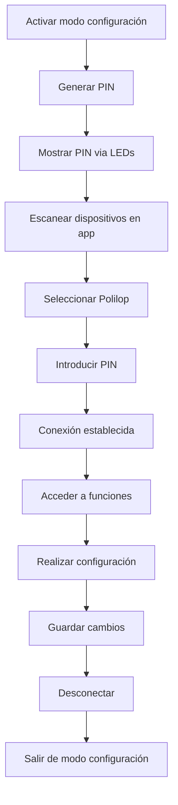

# Sistema de configuración Bluetooth - Polilop v2.0

## Descripción general

El sistema de configuración Bluetooth permite la administración remota del dispositivo Polilop v2.0 a través de una aplicación móvil Android o interfaz web. Este sistema está diseñado para tareas administrativas como configuración de conectividad y actualización de firmware.

## Acceso al modo de configuración

### Método 1: Botón oculto
- **Ubicación**: Base del dispositivo
- **Acción**: Presionar botón oculto por 3 segundos
- **Indicador**: LED azul parpadea lentamente (modo configuración activo)

### Método 2: Combinación de botones
- **Combinación**: Mantener botón de escaneo + botón de encendido simultáneamente
- **Duración**: 5 segundos
- **Indicador**: LED azul parpadea lentamente + beep de confirmación

## Funcionalidades disponibles

### 1. Configuración de conectividad WiFi
- **Escaneo de redes**: Lista redes disponibles con intensidad de señal
- **Agregar red**: SSID y contraseña
- **Priorización**: Establecer orden de preferencia
- **Eliminación**: Remover redes guardadas
- **Estado**: Verificar conexión actual

### 2. Configuración celular
- **Información del operador**: Mostrar operador actual y calidad de señal
- **APN**: Configurar puntos de acceso personalizados
- **Bandas**: Habilitar/deshabilitar bandas específicas (5G/4G/3G)
- **Roaming**: Configurar políticas de roaming

### 3. Actualización de firmware
- **Versión actual**: Mostrar firmware instalado
- **Verificar actualizaciones**: Consultar servidor de actualizaciones
- **Descarga**: Descargar nuevo firmware vía Bluetooth o WiFi/celular
- **Instalación**: Proceso de actualización con verificación de integridad
- **Rollback**: Reversión automática en caso de fallo

### 4. Diagnósticos del sistema
- **Estado de batería**: Nivel, salud, ciclos de carga
- **Estado de módulos**: GPS, escáner, conectividad
- **Logs del sistema**: Últimos eventos y errores
- **Pruebas**: Test de conectividad y funciones

## Protocolo de comunicación

### Características técnicas
- **Protocolo**: Bluetooth Low Energy (BLE)
- **Perfil**: Custom GATT service
- **Alcance**: 10 metros típico
- **Seguridad**: Pareado obligatorio + autenticación por PIN
- **Encriptación**: AES-128

### Estructura de servicios GATT

```
Polilop Configuration Service (UUID: 12345678-1234-1234-1234-123456789abc)
├── WiFi Configuration (UUID: 12345678-1234-1234-1234-123456789abd)
│   ├── Network List (Read/Notify)
│   ├── Add Network (Write)
│   └── Remove Network (Write)
├── Cellular Configuration (UUID: 12345678-1234-1234-1234-123456789abe)
│   ├── Operator Info (Read/Notify)
│   ├── APN Settings (Read/Write)
│   └── Band Selection (Read/Write)
├── Firmware Update (UUID: 12345678-1234-1234-1234-123456789abf)
│   ├── Version Info (Read)
│   ├── Update Command (Write)
│   └── Update Status (Read/Notify)
└── System Diagnostics (UUID: 12345678-1234-1234-1234-123456789ac0)
    ├── Battery Status (Read/Notify)
    ├── Module Status (Read/Notify)
    └── System Logs (Read)
```

## Aplicación móvil Android

### Características principales
- **Plataforma**: Android 8.0+ (API level 26+)
- **Permisos requeridos**: 
  - Bluetooth
  - Ubicación (para escaneo BLE)
- **Interfaz**: Material Design 3
- **Idioma**: Español mexicano

### Pantallas principales

#### 1. Pantalla de conexión
- Escaneo automático de dispositivos Polilop cercanos
- Lista de dispositivos con nombre e intensidad de señal
- Función de pareado con PIN de 6 dígitos
- Estado de conexión en tiempo real

#### 2. Dashboard principal
- Estado general del dispositivo
- Nivel de batería
- Estado de conectividad (WiFi, celular, GPS)
- Acceso rápido a funciones principales

#### 3. Configuración WiFi
- Lista de redes guardadas con prioridad
- Escanear redes disponibles
- Formulario para agregar nueva red
- Test de conectividad

#### 4. Configuración celular
- Información del operador actual
- Configuración de APN personalizado
- Selección de bandas de frecuencia
- Configuración de roaming

#### 5. Actualización de firmware
- Información de versión actual
- Verificación de actualizaciones disponibles
- Progreso de descarga e instalación
- Historial de actualizaciones

## Interfaz web alternativa

### Características
- **Tecnología**: Progressive Web App (PWA)
- **Compatibilidad**: Chrome/Edge con Web Bluetooth API
- **Responsive**: Adaptable a tablets y celulares
- **Offline**: Funcionalidad básica sin conexión a internet

### Ventajas de la interfaz web
- No requiere instalación de aplicación
- Compatible con tablets Android/iPad
- Funciona en computadoras con Bluetooth
- Actualizaciones automáticas

## Seguridad y autenticación

### Medidas de seguridad
- **Pareado obligatorio**: PIN de 6 dígitos generado aleatoriamente
- **Timeout de sesión**: 15 minutos de inactividad
- **Validación de comandos**: Checksum y validación de integridad
- **Logs de acceso**: Registro de todas las operaciones administrativas

### PIN de pareado
- Generado aleatoriamente al activar modo configuración
- Mostrado mediante secuencia de LEDs (sistema morse simplificado)
- Válido por 10 minutos
- Renovación automática después de cada sesión

## Estados visuales y auditivos

### Indicadores LED
- **LED verde (encendido/batería)**:
  - Sólido: Dispositivo encendido, batería >10%
  - Parpadeando rápido: Batería <10%
  - Parpadeando lento: Cargando batería
  - Sólido brillante: Carga completa
- **LED RGB**:
  - **Azul fijo**: Modo configuración activo
  - **Azul parpadeando lento**: Esperando conexión
  - **Azul parpadeando rápido**: Transferencia de datos
  - **Verde**: Operación exitosa
  - **Rojo**: Error en configuración

### Señales auditivas
- **Beep largo**: Modo configuración activado
- **Dos beeps**: Dispositivo conectado exitosamente
- **Tres beeps**: Configuración guardada
- **Beep grave**: Error en operación

## Flujo de configuración típico



## Consideraciones técnicas

### Limitaciones de Bluetooth LE
- **Velocidad de transferencia**: ~1KB/s para firmware updates
- **Alcance**: Máximo 10 metros en línea directa
- **Interferencia**: Puede verse afectado por WiFi 2.4GHz
- **Batería**: Consumo mínimo en modo standby

### Gestión de energía
- **Timeout automático**: Salida de modo configuración después de 30 minutos sin actividad
- **Suspensión BLE**: Desactivación automática para preservar batería
- **Indicador de batería baja**: Advertencia antes de operaciones críticas

## Casos de uso principales

### 1. Configuración inicial en campo
- Técnico activa modo configuración
- Configura redes WiFi del sitio
- Verifica conectividad celular
- Actualiza firmware si es necesario

### 2. Mantenimiento periódico
- Revisión de estado del dispositivo
- Actualización de configuración WiFi
- Instalación de actualizaciones de firmware
- Descarga de logs para análisis

### 3. Resolución de problemas
- Diagnóstico de conectividad
- Reset de configuración de red
- Instalación de firmware de recuperación
- Análisis de logs de error

---

*Sistema de configuración Bluetooth por Rodrigo Álvarez (@incognia) - Diseñado para administración segura y eficiente*
