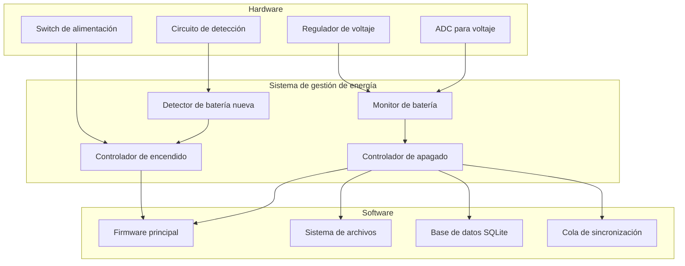
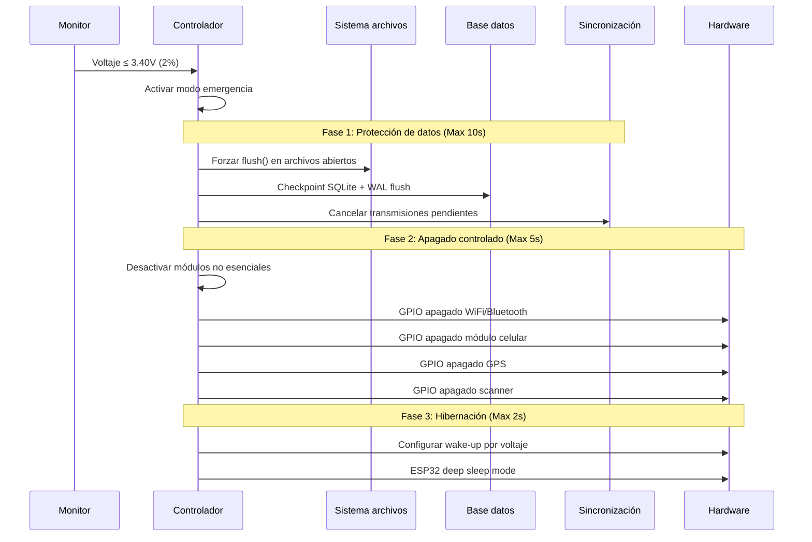
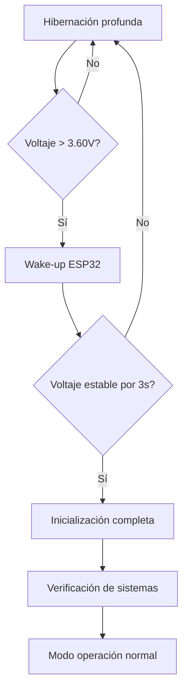
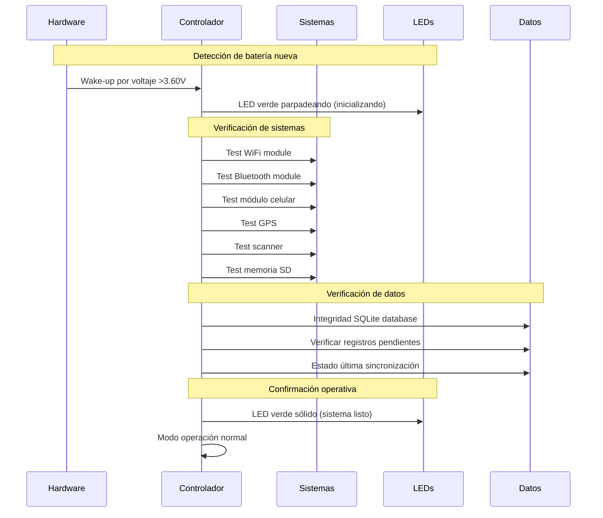

# Gestión de energía - Sistema de protección contra corrupción de datos

## Descripción del sistema

El sistema de gestión de energía de Polilop v2.0 está diseñado para **prevenir la corrupción de datos** mediante un apagado controlado cuando la batería alcanza niveles críticos, y proporcionar **encendido automático** cuando se instala una nueva batería.

## Requisitos funcionales

### 1. Protección contra corrupción de datos
- **Umbral crítico**: Apagado automático al 2% de batería
- **Apagado seguro**: Cierre controlado de archivos y sincronización de datos pendientes
- **Preservación de integridad**: Garantizar que no se pierdan registros de escaneo

### 2. Encendido automático
- **Detección de batería nueva**: Activación automática al conectar batería con carga suficiente
- **Umbral de encendido**: Activación con batería ≥10% para operación estable
- **Inicialización completa**: Verificación de todos los subsistemas al encender

## Arquitectura del sistema



## Componentes del sistema

### 1. Monitor de batería (Hardware + Software)

#### Hardware requerido
- **ADC del ESP32**: Pin analógico para lectura de voltaje
- **Divisor de voltaje**: Circuito para adaptación de niveles (3.7V → 3.3V)
- **Filtro capacitivo**: Para estabilizar lecturas (100nF recomendado)

#### Especificaciones técnicas
- **Frecuencia de muestreo**: Cada 30 segundos en operación normal
- **Resolución**: 12 bits (4096 niveles) del ADC del ESP32
- **Precisión requerida**: ±0.1V para detección confiable del 2%
- **Calibración**: Tabla de conversión voltaje-porcentaje para Li-Po

#### Tabla de voltajes Li-Po 3.7V
| Porcentaje | Voltaje | Estado |
|------------|---------|---------|
| 100% | 4.20V | Carga completa |
| 80% | 4.00V | Operación normal |
| 50% | 3.85V | Operación normal |
| 20% | 3.70V | Advertencia |
| 10% | 3.60V | Batería baja |
| 5% | 3.50V | Crítico |
| **2%** | **3.40V** | **Apagado inmediato** |
| 0% | 3.20V | Descarga completa |

### 2. Controlador de apagado seguro

#### Secuencia de apagado crítico (2% batería)



#### Estados de energía del sistema

1. **Operación normal** (>10%): Todos los módulos activos
2. **Modo ahorro** (10-5%): Reduce frecuencia GPS, apaga LEDs decorativos
3. **Modo crítico** (5-2%): Solo funciones esenciales, sin sincronización
4. **Apagado de emergencia** (≤2%): Secuencia de apagado seguro
5. **Hibernación profunda** (<2%): ESP32 en deep sleep

### 3. Detector de batería nueva

#### Hardware requerido
- **Comparador de voltaje**: Circuito para detectar cambio abrupto de voltaje
- **Condensador de retención**: Mantener referencia durante cambio de batería
- **Circuito de arranque**: Activación del ESP32 al detectar nueva batería

#### Lógica de detección


### 4. Controlador de encendido automático

#### Secuencia de inicialización



## Implementación por fases

### Fase 1: Sistema básico de monitoreo
- Lectura de voltaje de batería cada 30 segundos
- Cálculo de porcentaje basado en tabla de conversión
- Indicadores visuales en LED verde según estado

### Fase 2: Apagado seguro
- Implementación de umbral crítico al 2%
- Secuencia de cierre seguro de archivos y base de datos
- Modo hibernación profunda del ESP32

### Fase 3: Detección de batería nueva
- Circuito de detección de voltaje para wake-up
- Verificación de estabilidad de voltaje
- Activación condicional basada en carga mínima

### Fase 4: Encendido automático
- Secuencia de inicialización completa
- Verificación de integridad de todos los subsistemas  
- Restauración del estado operativo anterior

## Consideraciones técnicas

### Precisión de medición
- **Calibración necesaria**: Cada dispositivo debe calibrarse individualmente
- **Compensación por temperatura**: Ajustes para operación entre -10°C y +50°C
- **Filtrado de ruido**: Promedio móvil de 5 muestras para estabilidad

### Consumo energético del sistema
- **Monitor de batería**: ~2mA adicionales promedio
- **Circuito de detección**: ~0.5mA en hibernación
- **Impacto en autonomía**: <1% del consumo total del dispositivo

### Robustez del sistema
- **Tolerancia a fallos**: Múltiples verificaciones antes del apagado
- **Protección contra rebotes**: Filtros temporales para evitar apagados espurios
- **Recuperación de errores**: Reinicio automático si falla la secuencia

## Integración con el sistema principal

### Variables de estado compartidas
```python
# Estado global del sistema de energía
power_status = {
    'battery_voltage': 0.0,
    'battery_percentage': 0,
    'power_state': 'NORMAL',  # NORMAL, SAVING, CRITICAL, SHUTDOWN
    'last_measurement': 0,
    'shutdown_initiated': False
}
```

### APIs para otros módulos
- `get_battery_status()`: Estado actual de la batería
- `register_shutdown_callback()`: Registrar funciones de limpieza
- `is_power_critical()`: Verificar si está en modo crítico
- `request_priority_shutdown()`: Solicitar apagado inmediato

## Plan de pruebas

### Pruebas de laboratorio
1. **Simulación de descarga**: Usar fuente variable para simular descarga gradual
2. **Prueba de umbral crítico**: Verificar apagado exacto al 2%
3. **Prueba de encendido**: Confirmar activación automática con batería nueva
4. **Prueba de integridad**: Verificar que no se corrompen datos durante apagado

### Pruebas de campo
1. **Descarga real**: Operación hasta agotamiento de batería 4000mAh
2. **Cambio de batería**: Intercambio físico durante operación
3. **Condiciones extremas**: Pruebas en diferentes temperaturas
4. **Stress test**: Múltiples ciclos de descarga-recarga

## Métricas de éxito

- **Cero corrupción de datos**: 0% de archivos corruptos en 100 pruebas de descarga
- **Activación confiable**: >99% de encendidos exitosos con batería nueva  
- **Precisión de umbral**: Apagado dentro de ±0.05V del umbral configurado
- **Tiempo de respuesta**: Apagado seguro completado en <15 segundos

---

*Documentación técnica desarrollada por Rodrigo Álvarez (@incognia)*  
*Versión: 1.0 - Enero 2025*
