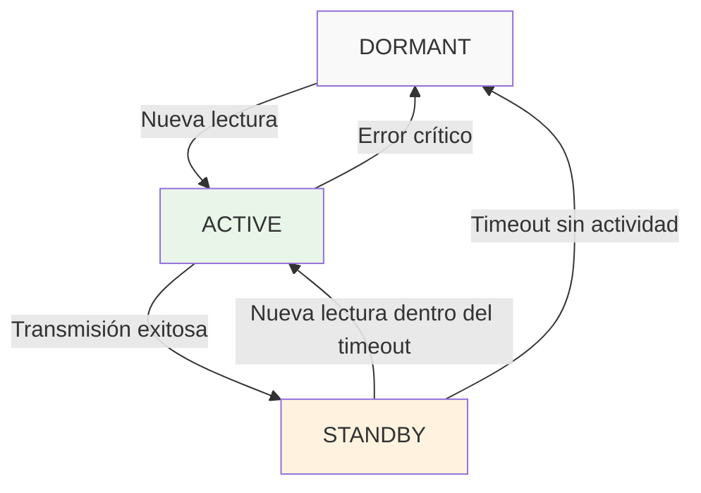

## Gestión inteligente de energía para conectividad

### Descripción del sistema

El sistema de gestión inteligente de energía para el módulo de conectividad está diseñado para incrementar la autonomía, encendiendo el módulo sólo cuando hay nuevas lecturas y manteniéndolo en modo activo o en espera según la actividad reciente.

### Estados del sistema

1. **DORMANT (Reposo):** Módulo de conectividad apagado por completo.
2. **ACTIVE (Activo):** Módulo encendido y transmitiendo datos.
3. **STANDBY (Espera):** Módulo en espera, esperando nuevas lecturas.

### Transiciones entre estados

- **DORMANT → ACTIVE:** Cuando se detecta una nueva lectura.
- **ACTIVE → STANDBY:** Después de transmitir exitosamente.
- **STANDBY → ACTIVE:** Si hay nuevas lecturas dentro del tiempo de espera configurado.
- **STANDBY → DORMANT:** Si no hay actividad durante el tiempo de espera.

### Parámetros configurables

- **Timeout de standby:** Tiempo que permanece en espera (ej: 2-5 minutos).
- **Batch timeout:** Tiempo máximo para agrupar múltiples lecturas.
- **Wake-up interval:** Intervalos de verificación de conectividad (opcional).

### Beneficios

Este enfoque asegura que el consumo de batería se minimice al mantener el módulo de conectividad apagado cuando no es necesario, lo que maximiza la autonomía del dispositivo.

### Implementación técnica

#### Estados y transiciones



#### Especificaciones de consumo

| Estado | Consumo WiFi | Consumo Celular | Duración típica |
|--------|--------------|-----------------|------------------|
| DORMANT | 0 mA | 0 mA | Indefinido |
| ACTIVE | ~150-200 mA | ~300-500 mA | 5-15 segundos |
| STANDBY | ~20-30 mA | ~50-80 mA | 2-5 minutos |

#### Algoritmo de gestión

```python
class ConnectivityPowerManager:
    def __init__(self):
        self.state = 'DORMANT'
        self.standby_timeout = 300  # 5 minutos
        self.batch_timeout = 30     # 30 segundos
        self.last_activity = 0
    
    def on_new_scan(self, scan_data):
        if self.state == 'DORMANT':
            self.activate_connectivity()
        elif self.state == 'STANDBY':
            self.state = 'ACTIVE'
        
        self.queue_for_transmission(scan_data)
        self.last_activity = time.time()
    
    def on_transmission_complete(self):
        if self.state == 'ACTIVE':
            self.state = 'STANDBY'
            self.schedule_timeout_check()
    
    def check_timeout(self):
        if self.state == 'STANDBY':
            if time.time() - self.last_activity > self.standby_timeout:
                self.deactivate_connectivity()
```

### Parámetros optimizados

#### Configuración por defecto

- **Standby timeout**: 300 segundos (5 minutos)
  - Balanza entre ahorro de energía y capacidad de respuesta
  - Permite agrupar múltiples escaneos subsecuentes

- **Batch timeout**: 30 segundos  
  - Tiempo máximo para agrupar transmisiones
  - Evita demoras excesivas en sincronización

- **Wake-up verification**: Cada 2 horas (opcional)
  - Verificación periódica de conectividad
  - Solo si hay datos pendientes de sincronización

#### Configuración avanzada (personalizable)

- **Modo agresivo**: Standby timeout 60 segundos
  - Mayor ahorro de energía
  - Para uso con baja frecuencia de escaneos

- **Modo responsivo**: Standby timeout 600 segundos (10 minutos)
  - Mayor capacidad de respuesta
  - Para uso con alta frecuencia de escaneos

### Estimación de ahorro energético

#### Escenario típico (8 horas de trabajo)

**Sin gestión inteligente:**
- Módulo celular activo 8 horas: 400mA × 8h = 3,200mAh
- Consumo total estimado: ~4,000mAh

**Con gestión inteligente:**
- Estado ACTIVE (20 activaciones × 10s): 400mA × 0.056h = 22mAh
- Estado STANDBY (20 períodos × 5min): 80mA × 1.67h = 133mAh
- Estado DORMANT (resto del tiempo): 0mA × 6.3h = 0mAh
- **Consumo total estimado: 155mAh**

**Ahorro energético: ~95% en conectividad celular**

#### Impacto en autonomía total

- **Sin gestión**: Autonomía ~10-12 horas
- **Con gestión**: Autonomía ~18-22 horas
- **Incremento**: +60-80% de autonomía

### Consideraciones de implementación

#### Hardware requerido

- **GPIO de control**: Pines para encender/apagar módulos
- **Circuitos de switch**: Relés o MOSFETs para corte de alimentación
- **Sensores de estado**: Feedback del estado de los módulos

#### Software requerido

- **Estado machine**: Gestión de transiciones de estado
- **Timer manager**: Gestión de timeouts y programación
- **Queue manager**: Cola de transmisiones pendientes
- **Power monitor**: Monitoreo de consumo energético

# Gestión de energía - Sistema de protección contra corrupción de datos

## Descripción del sistema

El sistema de gestión de energía de Polilop v2.0 está diseñado para **prevenir la corrupción de datos** mediante un apagado controlado cuando la batería alcanza niveles críticos, y proporcionar **encendido automático** cuando se instala una nueva batería.

## Requisitos funcionales

### 1. Protección contra corrupción de datos
- **Umbral crítico**: Apagado automático al 2% de batería
- **Apagado seguro**: Cierre controlado de archivos y sincronización de datos pendientes
- **Preservación de integridad**: Garantizar que no se pierdan registros de escaneo

### 2. Encendido automático
- **Detección de batería nueva**: Activación automática al conectar batería con carga suficiente
- **Umbral de encendido**: Activación con batería ≥10% para operación estable
- **Inicialización completa**: Verificación de todos los subsistemas al encender

## Arquitectura del sistema


## Componentes del sistema

### 1. Monitor de batería (Hardware + Software)

#### Hardware requerido
- **ADC del ESP32**: Pin analógico para lectura de voltaje
- **Divisor de voltaje**: Circuito para adaptación de niveles (3.7V → 3.3V)
- **Filtro capacitivo**: Para estabilizar lecturas (100nF recomendado)

#### Especificaciones técnicas
- **Frecuencia de muestreo**: Cada 30 segundos en operación normal
- **Resolución**: 12 bits (4096 niveles) del ADC del ESP32
- **Precisión requerida**: ±0.1V para detección confiable del 2%
- **Calibración**: Tabla de conversión voltaje-porcentaje para Li-Po

#### Tabla de voltajes Li-Po 3.7V
| Porcentaje | Voltaje | Estado |
|------------|---------|---------|
| 100% | 4.20V | Carga completa |
| 80% | 4.00V | Operación normal |
| 50% | 3.85V | Operación normal |
| 20% | 3.70V | Advertencia |
| 10% | 3.60V | Batería baja |
| 5% | 3.50V | Crítico |
| **2%** | **3.40V** | **Apagado inmediato** |
| 0% | 3.20V | Descarga completa |

### 2. Controlador de apagado seguro

#### Secuencia de apagado crítico (2% batería)


#### Estados de energía del sistema

1. **Operación normal** (>10%): Todos los módulos activos
2. **Modo ahorro** (10-5%): Reduce frecuencia GPS, apaga LEDs decorativos
3. **Modo crítico** (5-2%): Solo funciones esenciales, sin sincronización
4. **Apagado de emergencia** (≤2%): Secuencia de apagado seguro
5. **Hibernación profunda** (<2%): ESP32 en deep sleep

### 3. Detector de batería nueva

#### Hardware requerido
- **Comparador de voltaje**: Circuito para detectar cambio abrupto de voltaje
- **Condensador de retención**: Mantener referencia durante cambio de batería
- **Circuito de arranque**: Activación del ESP32 al detectar nueva batería

#### Lógica de detección


### 4. Controlador de encendido automático

#### Secuencia de inicialización


## Implementación por fases

### Fase 1: Sistema básico de monitoreo
- Lectura de voltaje de batería cada 30 segundos
- Cálculo de porcentaje basado en tabla de conversión
- Indicadores visuales en LED verde según estado

### Fase 2: Apagado seguro
- Implementación de umbral crítico al 2%
- Secuencia de cierre seguro de archivos y base de datos
- Modo hibernación profunda del ESP32

### Fase 3: Detección de batería nueva
- Circuito de detección de voltaje para wake-up
- Verificación de estabilidad de voltaje
- Activación condicional basada en carga mínima

### Fase 4: Encendido automático
- Secuencia de inicialización completa
- Verificación de integridad de todos los subsistemas  
- Restauración del estado operativo anterior

## Consideraciones técnicas

### Precisión de medición
- **Calibración necesaria**: Cada dispositivo debe calibrarse individualmente
- **Compensación por temperatura**: Ajustes para operación entre -10°C y +50°C
- **Filtrado de ruido**: Promedio móvil de 5 muestras para estabilidad

### Consumo energético del sistema
- **Monitor de batería**: ~2mA adicionales promedio
- **Circuito de detección**: ~0.5mA en hibernación
- **Impacto en autonomía**: <1% del consumo total del dispositivo

### Robustez del sistema
- **Tolerancia a fallos**: Múltiples verificaciones antes del apagado
- **Protección contra rebotes**: Filtros temporales para evitar apagados espurios
- **Recuperación de errores**: Reinicio automático si falla la secuencia

## Integración con el sistema principal

### Variables de estado compartidas
```python
# Estado global del sistema de energía
power_status = {
    'battery_voltage': 0.0,
    'battery_percentage': 0,
    'power_state': 'NORMAL',  # NORMAL, SAVING, CRITICAL, SHUTDOWN
    'last_measurement': 0,
    'shutdown_initiated': False
}
```

### APIs para otros módulos
- `get_battery_status()`: Estado actual de la batería
- `register_shutdown_callback()`: Registrar funciones de limpieza
- `is_power_critical()`: Verificar si está en modo crítico
- `request_priority_shutdown()`: Solicitar apagado inmediato

## Plan de pruebas

### Pruebas de laboratorio
1. **Simulación de descarga**: Usar fuente variable para simular descarga gradual
2. **Prueba de umbral crítico**: Verificar apagado exacto al 2%
3. **Prueba de encendido**: Confirmar activación automática con batería nueva
4. **Prueba de integridad**: Verificar que no se corrompen datos durante apagado

### Pruebas de campo
1. **Descarga real**: Operación hasta agotamiento de batería 4000mAh
2. **Cambio de batería**: Intercambio físico durante operación
3. **Condiciones extremas**: Pruebas en diferentes temperaturas
4. **Stress test**: Múltiples ciclos de descarga-recarga

## Métricas de éxito

- **Cero corrupción de datos**: 0% de archivos corruptos en 100 pruebas de descarga
- **Activación confiable**: >99% de encendidos exitosos con batería nueva  
- **Precisión de umbral**: Apagado dentro de ±0.05V del umbral configurado
- **Tiempo de respuesta**: Apagado seguro completado en <15 segundos

---

*Documentación técnica desarrollada por Rodrigo Álvarez (@incognia)*  
*Versión: 1.0 - Enero 2025*
