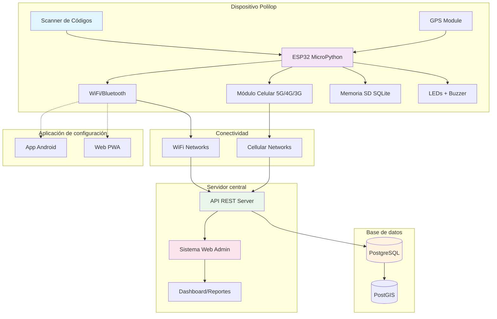
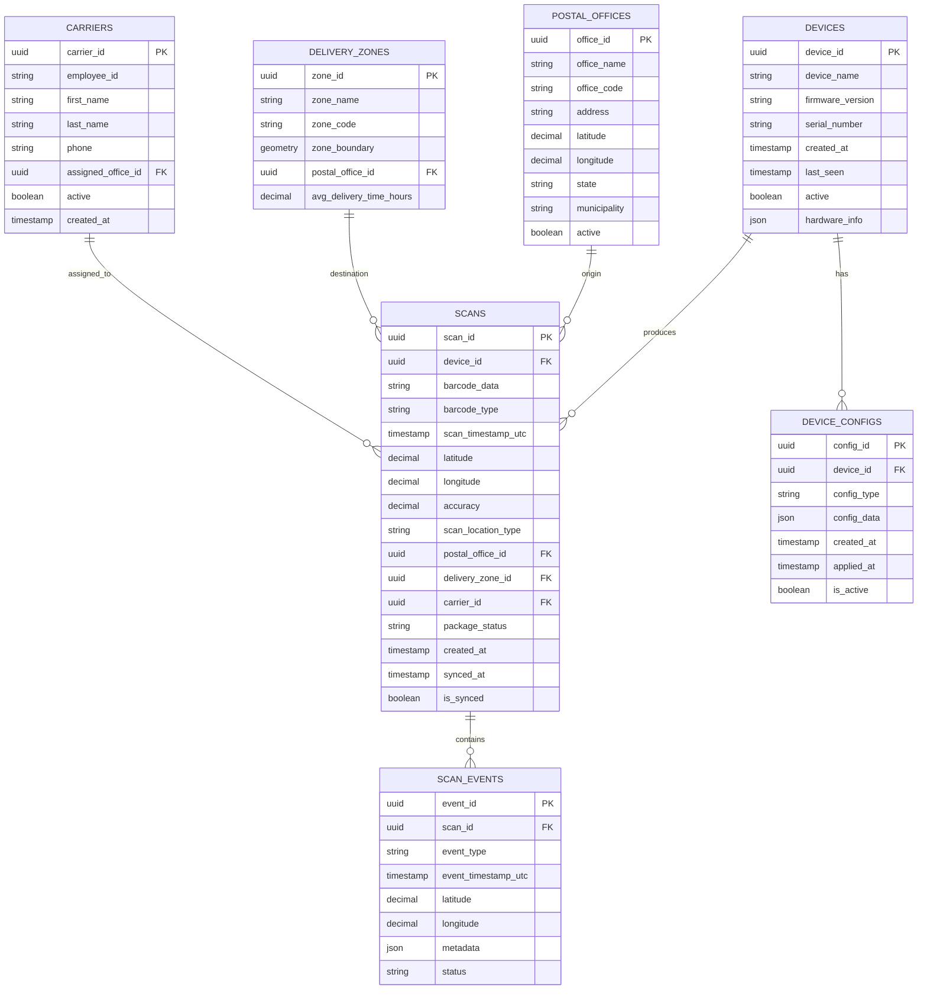
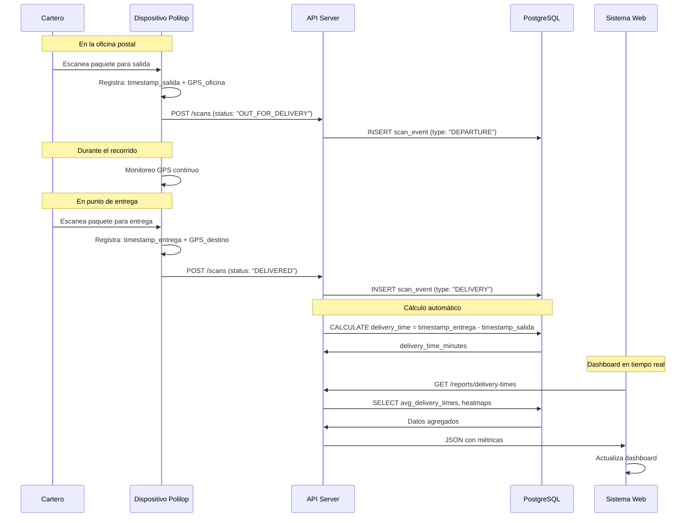
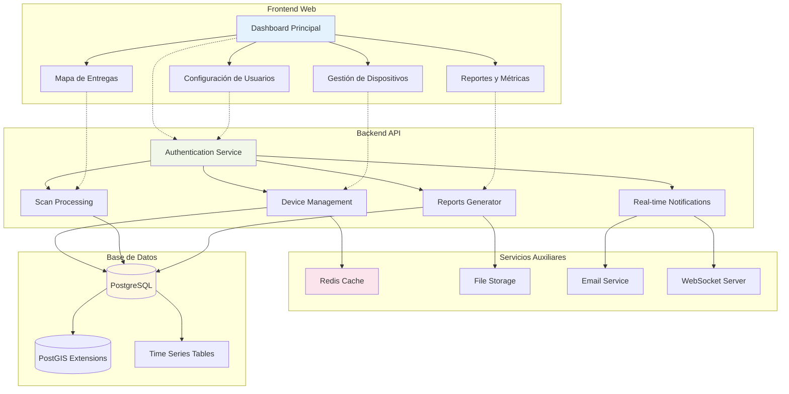
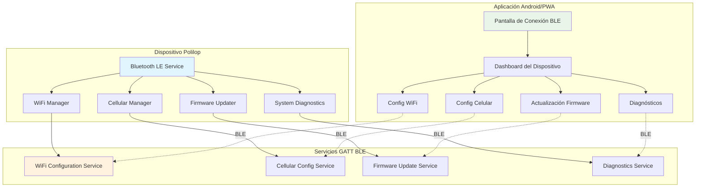
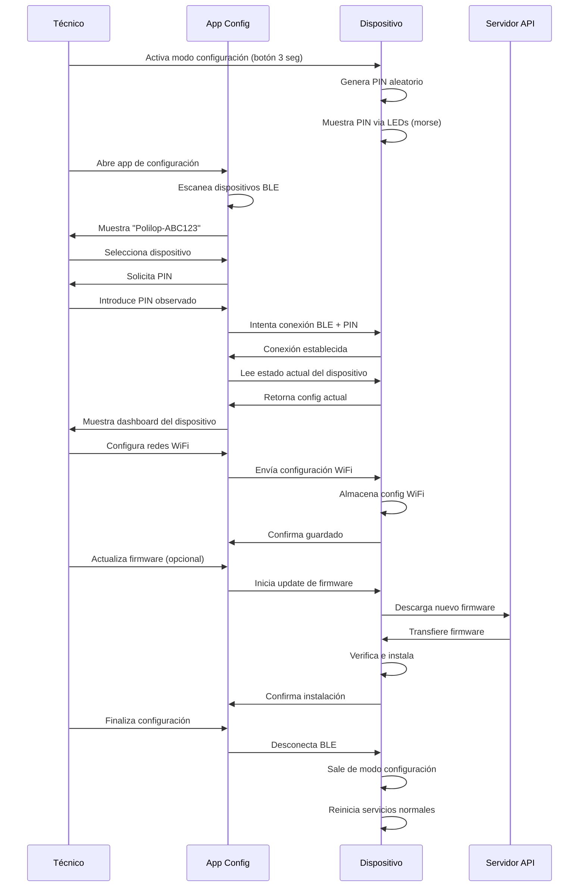

# Arquitectura del sistema Polilop v2.0

## Arquitectura general del sistema

## Esquema de base de datos PostgreSQL

## Flujo de datos para seguimiento de entregas

## Arquitectura de la aplicación web de administración

## Aplicación de configuración del dispositivo

## Flujo de configuración inicial del dispositivo

---

*Diagramas de arquitectura por Rodrigo Álvarez (@incognia)*
