# Conexiones del PCB del dispositivo Polilop v2.0

## Diagrama principal de conexiones

```mermaid
graph TB
    subgraph "ESP32-WROOM-32 Module"
        ESP32[ESP32 Core]
        GPIO2[GPIO2 - LED RGB]
        GPIO4[GPIO4 - SD_CS]
        GPIO5[GPIO5 - Scan Button]
        GPIO12[GPIO12 - MISO]
        GPIO13[GPIO13 - MOSI]
        GPIO14[GPIO14 - SCK]
        GPIO16[GPIO16 - GPS_RX]
        GPIO17[GPIO17 - GPS_TX]
        GPIO18[GPIO18 - Power LED]
        GPIO19[GPIO19 - Cellular_RX]
        GPIO21[GPIO21 - Cellular_TX]
        GPIO22[GPIO22 - Scanner_RX]
        GPIO23[GPIO23 - Scanner_TX]
        GPIO25[GPIO25 - Buzzer]
        GPIO26[GPIO26 - Power Button]
        GPIO27[GPIO27 - Battery Monitor]
        VCC[3.3V Rail]
        GND[GND Rail]
    end
    
    subgraph "Power Management"
        BATT[Li-Ion 18650<br/>3.7V 3000mAh]
        USBC[USB-C Connector<br/>5V Charging]
        CHRG[TP4056 Charger<br/>Module]
        REG[AMS1117 3.3V<br/>Regulator]
        PWR_SW[Power Switch]
        
        BATT --> CHRG
        USBC --> CHRG
        CHRG --> PWR_SW
        PWR_SW --> REG
        REG --> VCC
    end
    
    subgraph "Cellular Module"
        CELL[SIM7600G-H<br/>5G/4G/3G Module]
        SIM[Nano SIM Slot]
        ANT_CELL[Cellular Antenna]
        
        SIM --> CELL
        CELL --> ANT_CELL
    end
    
    subgraph "GPS Module"
        GPS[NEO-8M GPS<br/>Module]
        ANT_GPS[GPS Antenna]
        
        GPS --> ANT_GPS
    end
    
    subgraph "Storage"
        SD[MicroSD Card<br/>Slot]
    end
    
    subgraph "Scanner Module"
        SCAN[2D Barcode<br/>Scanner Engine]
        SCAN_PWR[Scanner Power<br/>Control]
    end
    
    subgraph "User Interface"
        LED_RGB[RGB LED<br/>Status Indicator]
        LED_PWR[Green LED<br/>Power/Battery]
        BUZZ[Piezo Buzzer<br/>3.3V]
        BTN_SCAN[Scan Button<br/>Large Tactile]
        BTN_PWR[Power Button<br/>Small Tactile]
        BTN_CFG[Config Button<br/>Hidden/Recessed]
    end
    
    %% Power connections
    VCC --> GPS
    VCC --> CELL
    VCC --> SD
    VCC --> SCAN_PWR
    VCC --> LED_RGB
    VCC --> LED_PWR
    VCC --> BUZZ
    
    GND --> GPS
    GND --> CELL
    GND --> SD
    GND --> SCAN
    GND --> LED_RGB
    GND --> LED_PWR
    GND --> BUZZ
    GND --> BTN_SCAN
    GND --> BTN_PWR
    GND --> BTN_CFG
    
    %% Data connections
    GPIO16 --> GPS
    GPIO17 --> GPS
    GPIO19 --> CELL
    GPIO21 --> CELL
    GPIO22 --> SCAN
    GPIO23 --> SCAN
    
    %% SPI connections for SD card
    GPIO4 --> SD
    GPIO12 --> SD
    GPIO13 --> SD
    GPIO14 --> SD
    
    %% UI connections
    GPIO2 --> LED_RGB
    GPIO18 --> LED_PWR
    GPIO25 --> BUZZ
    GPIO5 --> BTN_SCAN
    GPIO26 --> BTN_PWR
    GPIO0 --> BTN_CFG
    
    %% Battery monitoring
    GPIO27 --> BATT
    
    %% Scanner power control
    SCAN_PWR --> SCAN
    GPIO15[GPIO15 - Scanner Enable] --> SCAN_PWR
```

## Asignación de pines del ESP32

| Pin | Función | Descripción |
|-----|---------|-------------|
| GPIO0 | Config Button | Botón de configuración (pull-up interno) |
| GPIO2 | RGB LED Data | Control del LED RGB de estado |
| GPIO4 | SD_CS | Chip Select para tarjeta SD |
| GPIO5 | Scan Button | Botón de escaneo principal |
| GPIO12 | SPI MISO | Datos SD card (entrada) |
| GPIO13 | SPI MOSI | Datos SD card (salida) |
| GPIO14 | SPI SCK | Clock SPI para SD card |
| GPIO15 | Scanner Enable | Control de alimentación del scanner |
| GPIO16 | GPS RX | Recepción UART del módulo GPS |
| GPIO17 | GPS TX | Transmisión UART del módulo GPS |
| GPIO18 | Power LED | LED verde de encendido/batería |
| GPIO19 | Cellular RX | Recepción UART del módulo celular |
| GPIO21 | Cellular TX | Transmisión UART del módulo celular |
| GPIO22 | Scanner RX | Recepción UART del scanner |
| GPIO23 | Scanner TX | Transmisión UART del scanner |
| GPIO25 | Buzzer | Control del buzzer piezo |
| GPIO26 | Power Button | Botón de encendido |
| GPIO27 | Battery ADC | Monitor de voltaje de batería |

## Especificaciones de componentes

### Microcontrolador
- **ESP32-WROOM-32**: 240MHz dual-core, WiFi + Bluetooth
- **Flash**: 4MB integrada
- **RAM**: 520KB SRAM

### Comunicaciones
- **GPS**: NEO-8M con antena cerámica
- **Celular**: SIM7600G-H con soporte 5G/4G/3G
- **Antenas**: Integradas en PCB o conectores U.FL

### Almacenamiento
- **SD Card**: Slot para MicroSD hasta 32GB
- **Formato**: SQLite local

### Alimentación
- **Batería**: Li-Ion 18650 3.7V 3000mAh
- **Carga**: USB-C con TP4056
- **Regulador**: AMS1117 3.3V 1A
- **Autonomía**: 8-12 horas uso continuo

### Scanner
- **Tipo**: Módulo 2D (QR + DataMatrix + Code128)
- **Interfaz**: UART 9600 baud
- **Rango**: 5cm - 30cm

### Interfaz de usuario
- **LED RGB**: WS2812B para estados
- **LED Verde**: Indicador de encendido/batería
- **Buzzer**: Piezo 3.3V feedback auditivo
- **Botones**: Tactiles con debounce por software

---

*Diagrama conceptual de las conexiones del PCB del dispositivo Polilop*
